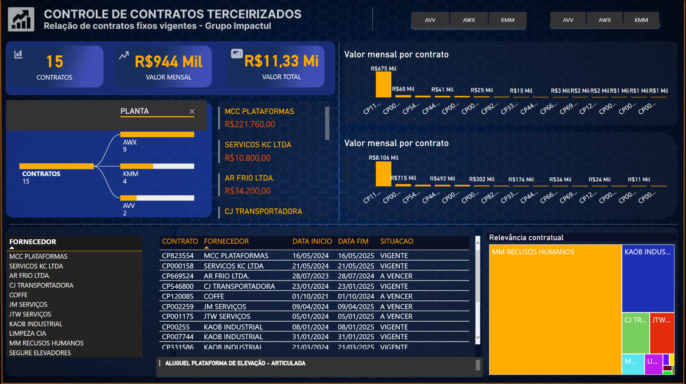

# 📊 Dashboard de Controle de Contratos Terceirizados – Power BI

## 🧾 Descrição do Projeto

Este projeto foi desenvolvido com o objetivo de fornecer um painel de controle interativo e visual para o acompanhamento de contratos terceirizados de uma empresa do setor industrial.  

O dashboard permite que a gestão acompanhe com facilidade:

- Quantos contratos estão ativos;
- Qual o valor mensal de cada contrato;
- O valor total contratado;
- Datas de início e fim;
- Status de vigência;
- A relevância financeira de cada fornecedor.

O projeto foi totalmente desenvolvido no **Power BI**, com foco em **clareza visual**, **facilidade de navegação** e **suporte à tomada de decisões**.

---

## 🛠️ Ferramentas Utilizadas

- **Power BI Desktop**: criação dos gráficos, segmentações, medidas e layout do dashboard.
- **Power Query**: tratamento, limpeza e modelagem dos dados antes da visualização.
- **DAX (Data Analysis Expressions)**: criação de medidas personalizadas e cálculos dinâmicos.
- **Excel**: utilizado como fonte dos dados contratuais.

---

## 🧠 Habilidades Aplicadas

- **Modelagem de dados**: relacionamentos entre tabelas de contratos, fornecedores e plantas industriais.
- **Criação de medidas DAX**: total contratado, valor mensal, contratos vigentes e vencidos.
- **Segmentação dinâmica**: por planta, status dos contratos e fornecedores.
- **Tratamento de dados no Power Query**: formatos de datas, colunas de status e valores monetários.
- **Design de dashboards**: uso de boas práticas de visualização de dados (treemaps, gráficos de barras, KPIs, etc.).
- **Pensamento analítico**: organização da informação com foco na tomada de decisão pela gestão.

---

## 📌 Principais Funcionalidades do Dashboard

- Visão geral com **indicadores-chave**: quantidade de contratos, valor mensal total e valor total contratado.
- **Gráfico de barras** com os contratos de maior impacto financeiro mensal.
- **Treemap interativo** com a relevância percentual de cada fornecedor.
- **Tabela detalhada** com nome do contrato, fornecedor, datas e status.
- **Segmentações** por planta (AWX, KMM, AVV) e status do contrato (vigente ou a vencer).

---

## ✅ Resultados Esperados

Com esse painel, é possível:

- Acompanhar contratos que estão próximos do vencimento e se antecipar a renovações ou negociações;
- Identificar fornecedores estratégicos com base na participação financeira;
- Avaliar a distribuição dos contratos entre as unidades da empresa (plantas);
- Apoiar o s
