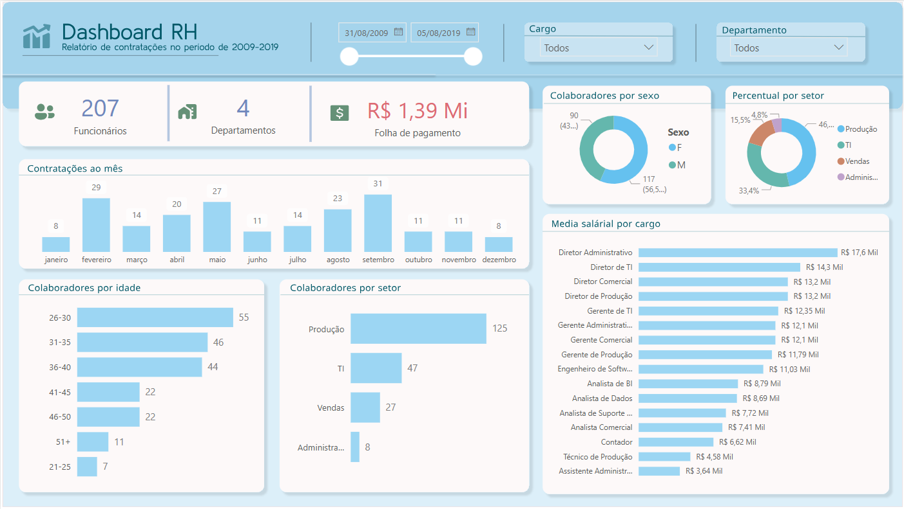

# 📊 Dashboard RH – Análise de Contratações (2009–2019)

Este projeto apresenta um **Dashboard de Recursos Humanos** desenvolvido no Power BI, com o objetivo de visualizar e analisar dados de contratações no período de 2009 a 2019 de uma empresa ficticia. A proposta faz parte do meu portfólio como Analista de Dados, demonstrando minhas habilidades com visualização de dados e tomada de decisão baseada em dados.

## 📷 Captura de Tela

---

## 📌 Objetivo

Fornecer uma visão clara e interativa sobre o histórico de contratações da empresa, segmentando informações por período, idade, setor, cargo, sexo e folha de pagamento.

---

## 🧰 Ferramentas Utilizadas

- **Power BI**
- **Excel** (como fonte de dados)
- **DAX** para cálculos e medidas
- **Power Query** para tratamento de dados

---

## 📈 Visões do Dashboard

- **Total de funcionários** contratados no período
- **Número de departamentos** ativos
- **Folha de pagamento total**
- **Contratações por mês**
- **Distribuição por idade**
- **Distribuição por setor**
- **Percentual por sexo e setor**
- **Média salarial por cargo**
- **Filtros dinâmicos** por data, cargo e departamento

---

## 🧠 Insights Possíveis

- Setor de **produção** lidera em número de colaboradores (46%)
- Maioria dos colaboradores tem entre **26 e 35 anos**
- Folha de pagamento gira em torno de **R$ 1,39 milhões**
- Cargos de diretoria concentram os **maiores salários**
- Equilíbrio de gênero próximo, com leve maioria masculina

---

## 🚀 Próximos Passos

- Conectar o dashboard a um banco de dados real (PostgreSQL ou SQL Server)
- Aplicar RLS (segurança em nível de linha)
- Disponibilizar versão pública via Power BI Service

---

## 👨‍💻 Sobre Mim

Sou Gustavo Viana, Analista de Dados com formação técnica em Informática pelo Instituto Federal do Pará e estudante de Engenharia de Computação na UFPA. Tenho experiência na construção de relatórios gerenciais, dashboards interativos e análise de dados para suporte à tomada de decisão. Atuo com ferramentas como Power BI, Excel, SQL e Python, aplicando boas práticas de visualização e modelagem de dados para gerar insights relevantes ao negócio.

---

## 📬 Contato

- 📧 Email: eng.gustavoviana@yahoo.com
- 💼 LinkedIn: [linkedin.com/in/gustavovianads](https://www.linkedin.com/in/enggustavoviana)

