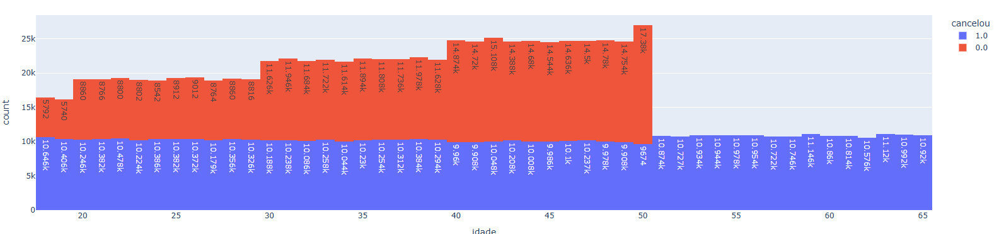
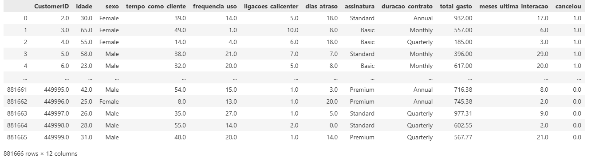
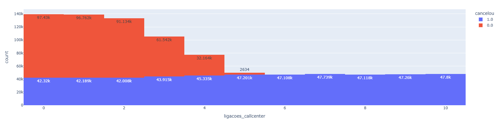
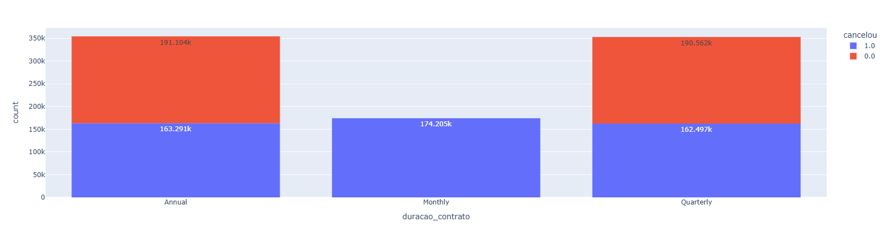
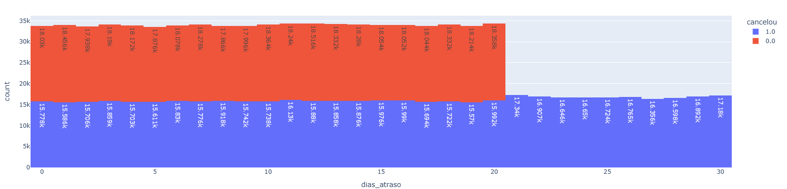

# 📊 Python Insights - Previsão de Cancelamento de Clientes (Churn Prediction)

Este projeto tem como objetivo realizar uma **análise exploratória e diagnóstica** em Python, focada na **previsão de cancelamento de clientes** (*Churn Prediction*). Através de uma abordagem baseada em dados, buscamos compreender os principais fatores que levam clientes a encerrar seu vínculo com um serviço e propor **ações estratégicas para aumentar a retenção**.





---

## 🧠 Objetivo do Projeto

Identificar padrões de comportamento entre os clientes que cancelaram o serviço e:

- Descobrir os **principais fatores** que contribuem para o churn;
- Fornecer **insights acionáveis** para a equipe de marketing, atendimento e cobrança;
- Simular o **impacto positivo de ações de retenção**;
- Reduzir a taxa de cancelamento e melhorar a experiência do cliente.

---

## 📁 Base de Dados

A base contém informações relevantes sobre o comportamento e perfil dos clientes, como:

- Tempo de contrato (mensal, anual);
- Quantidade de ligações ao call center;
- Dias em atraso no pagamento;
- Idade dos clientes, entre outros.

---

## ⚙️ Tecnologias Utilizadas

- **Python 3.11+**
- **Pandas** para manipulação e limpeza de dados
- **Plotly Express** para visualização interativa
- **Jupyter Notebook** para execução passo a passo

---

## 🔍 Etapas da Análise


### ✅ 1. Importação e Visualização Inicial dos Dados

```python
import pandas as pd

display(tabela)

```





### ✅ 2. Limpeza dos Dados

- Remoção de colunas irrelevantes (CustomerID);
- Exclusão de dados faltantes;
- Ajustes de formato e estrutura.

```python

tabela = tabela.drop(columns="CustomerID")

tabela = tabela.dropna()

```

### ✅ 3. Análise Exploratória (EDA)

- Avaliação da taxa de cancelamento:

```python

tabela["cancelou"].value_counts(normalize=True)

```

- Geração de gráficos por variável:

```python

  import plotly.express as px
  for coluna in tabela.columns:
    grafico = px.histogram(tabela, x=coluna, color="cancelou", text_auto=True)
    grafico.show()

```


### ✅ 4. Análise Diagnóstica

### Insights obtidos:

#### Clientes com idade acima de 50 anos: todos cancelaram.
     - 💡 Recomenda-se campanhas focadas nesse público.


    

#### Mais de 4 ligações ao call center: cancelamento quase certo.
     - 💡 Melhorar atendimento e criar alertas para alta frequência de chamadas.




  #### Contrato mensal: taxa de cancelamento elevada.
      -💡 Promover planos anuais com vantagens.




#### Mais de 20 dias de atraso: todos cancelaram.
     -💡 Disparar alertas de cobrança a partir de 10 dias de atraso.




## Simulação de Impacto (Pós-Ação)

### 🔧 Aplicação de Filtros:

### 1. Redução no número de ligações ao call center:

```python
condicao = tabela["ligacoes_callcenter"] <= 4
tabela = tabela[condicao]
display(tabela["cancelou"].value_counts(normalize=True))

```
#### Churn caiu de 56,7% → 36,3%

### 2. Limitação dos dias de atraso:

```python
condicao = tabela["dias_atraso"] <= 20
tabela = tabela[condicao]
display(tabela["cancelou"].value_counts(normalize=True))

```

#### Churn caiu de 36,3% → 26,9%


### 3. Substituição de contratos mensais por anuais:

```python

condicao = tabela["duracao_contrato"] != "Monthly"
tabela = tabela[condicao]
display(tabela["cancelou"].value_counts(normalize=True))

```

#### Churn caiu de 26,9% → 18,4%

### 📊 Resultado Final

| Métrica                      | Antes da Ação | Após Ação |
| ---------------------------- | ------------- | --------- |
| Taxa de Cancelamento (Churn) | 56,7%         | 18,4%     |
| Taxa de Retenção             | 43,3%         | 81,6%     |


- Com ações estratégicas baseadas nos dados, conseguimos reduzir o cancelamento em mais de 67% e aumentar a fidelização em quase 89%.


### 💡 Conclusão

#### Este projeto demonstra como uma análise de churn bem estruturada pode transformar dados em ações concretas. Além de melhorar os resultados do negócio, ele mostra ao recrutador a sua capacidade de:

 ✅ Realizar análises profundas com Python;

 ✅ Traduzir dados em insights estratégicos;

 ✅ Trabalhar com limpeza e visualização de dados;

 ✅ Compreender problemas de negócio e propor soluções eficazes.

  
