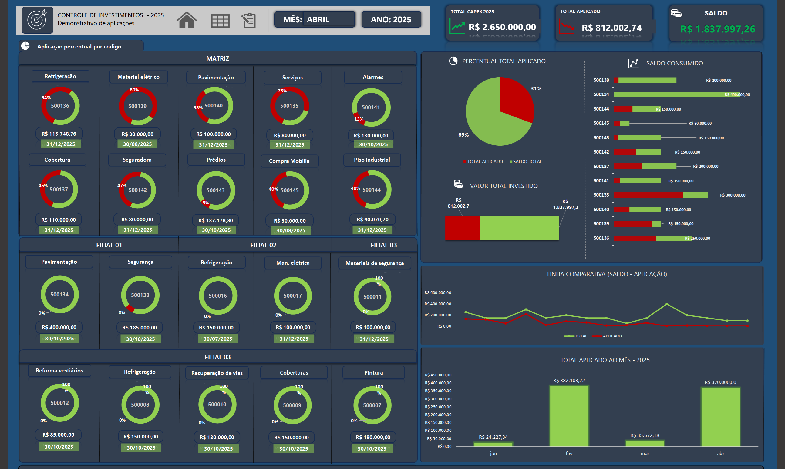

# 📊 Dashboard de Controle de Investimentos - Excel

Este projeto apresenta um dashboard interativo desenvolvido em **Excel** para o controle de investimentos de capital em diferentes áreas de uma organização. O objetivo principal é **monitorar a alocação de recursos**, identificar o percentual aplicado por projeto e comparar a evolução dos investimentos ao longo do tempo.

## 🧩 Funcionalidades

- Indicadores visuais por setor e filial (aplicação percentual).
- Visão consolidada do **total aplicado, saldo e valor total investido**.
- Gráficos de **pizza, barra e linha** para facilitar a análise visual.
- Comparação entre **saldo disponível vs aplicação realizada**.
- Distribuição dos investimentos ao longo dos meses do ano.
- Aplicações organizadas por **código de projeto**, área e filial.

## 📈 Principais Indicadores

- Total disponível no ano
- Total aplicado no período
- Saldo restante
- Percentual aplicado por projeto
- Evolução mensal dos investimentos
- Comparação gráfica entre saldo e aplicação

## 🛠️ Tecnologias Utilizadas

- Microsoft Excel
- Tabelas dinâmicas 
- Formatação condicional
- Controles visuais (barras, cartões e indicadores circulares)
- Layout corporativo

## ✅ Resultados Esperados

- Com o painel de controle de investimentos, é possível:

- Visualizar com clareza o percentual de aplicação de cada centro de custo (por código), facilitando a gestão do CAPEX;

- Acompanhar a evolução mensal das aplicações, comparando valores aplicados e saldos disponíveis;

- Identificar áreas com baixa execução orçamentária e atuar preventivamente para garantir o cumprimento do plano de investimentos;

- Analisar por filial e por categoria os investimentos realizados, promovendo uma alocação mais eficiente dos recursos;

- Fornecer à liderança uma visão consolidada e visualmente clara do status dos investimentos por projeto, centro de custo e unidade;

- Otimizar o processo de tomada de decisão com base em dados atualizados e visuais intuitivos;

- Aumentar a transparência e o controle financeiro em projetos de infraestrutura e melhorias operacionais.

